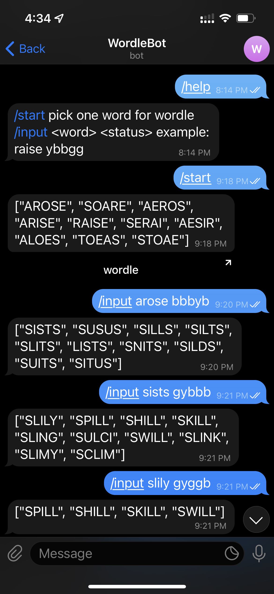

# wordle-project
this is a wordle guessing tool  

Wordle is a popular daily 5 letter word game and this project is to suggest word for user to guess.

## Install package 

```
python3 -m pip install -r requirements.txt
```

## Usage
word : 5-letter word for wordle  
status : 5 length status shown on the board (y-yellow, g-green, b-black)
```
wordle = Wordle()
wordle.insert(word, status)
wordle.get_suggested_words()
```

## telegram bot


## Contributing
Pull requests are welcome. For major changes, please open an issue first to discuss what you would like to change.

Please make sure to update tests as appropriate.

## License
Macy Fong